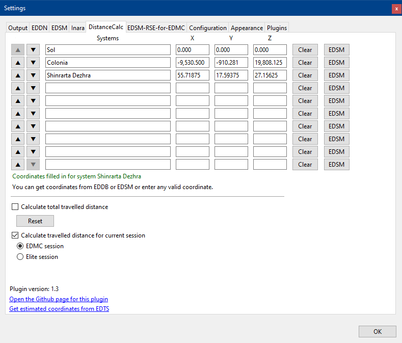

# Distance Calculator plugin for [EDMC](https://github.com/Marginal/EDMarketConnector/wiki)

This plugin displays the distance to up to three points you can freely specify. The distance is updated after each FSD jump.

## Installation

1. On EDMC's Plugins settings tab press the _Open_ button. This reveals the _plugins_ folder where EDMC looks for plugins.
2. Download the [latest release](https://github.com/Thurion/DistanceCalc/releases).
3. Open the _.zip_ archive that you downloaded and move the _DistanceCalc_ folder contained inside into the _plugins_ folder.

You will need to re-start EDMC for it to notice the new plugin.

## Usage

You can add up to three systems or points in the settings. Non valid entries (e.g. x, y or z is empty) won't be stored when you close the settings.
It is possible to clear an entire row by pressing the _Clear_ button. The _EDSM_ button fills in the coordinates for a system providing the system name can be found on EDSM.

Once at least one system/point has been added in the settings, the main window shows the distance from your current location to those systems/points in light years.
